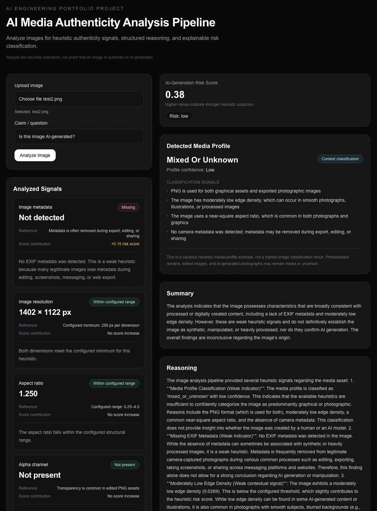
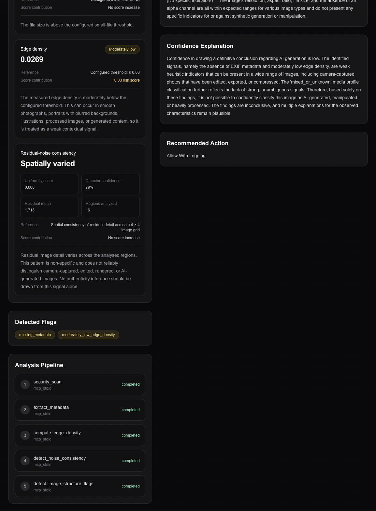

# AI Media Authenticity Analysis Pipeline

**Analyze images for heuristic authenticity signals, structured
reasoning, and explainable risk classification.**

<table>
<tr>
<td width="50%">



</td>
<td width="50%">



</td>
</tr>
</table>


------------------------------------------------------------------------

## Overview

This project demonstrates a **modular, explainable media authenticity
analysis pipeline** built around **LangGraph**, the **Model Context
Protocol (MCP)** and LLM-based reasoning.

Rather than attempting to build a definitive AI-image detector, the
system combines multiple independent forensic heuristics into a
transparent assessment pipeline. Every stage produces structured
evidence that is orchestrated, interpreted and presented with clear
explanations.

The emphasis is on **AI engineering**, **workflow orchestration**,
**explainability**, **evaluation**, and **extensible system
architecture**.

------------------------------------------------------------------------

## Why this project?

Modern generative models increasingly resemble authentic photographs,
making lightweight heuristic detection unreliable when used in
isolation.

Instead of making strong origin claims, this project demonstrates how
independent forensic tools can be orchestrated into an explainable
evidence pipeline.

### Highlights

-   LangGraph workflow orchestration
-   Model Context Protocol (MCP)
-   Modular forensic tools
-   Explainable AI
-   Structured reasoning
-   Prompt engineering
-   Evaluation framework
-   Next.js + FastAPI architecture

------------------------------------------------------------------------

## Architecture

``` text
Image Upload
      │
      ▼
Security Validation (MCP)
      │
      ▼
Metadata Extraction (MCP)
      │
      ▼
Edge Density Analysis (MCP)
      │
      ▼
Residual Noise Analysis (MCP)
      │
      ▼
Image Structure Analysis (MCP)
      │
      ▼
LangGraph Orchestration
      │
      ▼
Rule-Based + Gemini Reasoning
      │
      ▼
Explainable Risk Assessment
      │
      ▼
Next.js Frontend
```

Each analysis stage is implemented as an independent MCP tool, making
the pipeline straightforward to extend.

------------------------------------------------------------------------

## Explainable Output

The interface presents:

-   AI Generation Risk Score
-   Detected Media Profile
-   Profile Confidence
-   Analyst Summary
-   Individual Evidence Signals
-   Score Contribution
-   Pipeline Execution Trace

------------------------------------------------------------------------

## Evaluation

The repository includes an evaluation framework for comparing reasoning
strategies and prompt versions.

It captures:

-   latency
-   prompt version
-   reasoning mode
-   extracted signals
-   confidence
-   risk score
-   generated reasoning

The framework is intended to evaluate pipeline behaviour rather than
benchmark AI-detection accuracy.

------------------------------------------------------------------------

## Technology Stack

**AI**

-   Python
-   LangGraph
-   Gemini
-   Pydantic

**MCP**

-   Security Scan
-   Metadata Extraction
-   Edge Density Analysis
-   Residual Noise Analysis
-   Image Structure Analysis

**Frontend**

-   Next.js
-   React
-   TypeScript

**Backend**

-   FastAPI
-   Node.js API Gateway

**DevOps**

-   Azure DevOps Pipelines
-   GitHub

------------------------------------------------------------------------

## Limitations

This project intentionally does **not** claim reliable attribution of
modern AI-generated images.

Instead, it demonstrates a realistic engineering architecture for
collecting, orchestrating and explaining forensic evidence. Additional
forensic detectors or learned models can be integrated into the existing
MCP pipeline without changing the orchestration workflow.

------------------------------------------------------------------------

## Future Improvements

-   Additional forensic MCP tools
-   Larger benchmark datasets
-   Containerized deployment
-   Hosted inference API
-   Evaluation dashboards

------------------------------------------------------------------------

## Key Takeaways

-   LangGraph orchestration
-   MCP integration
-   Explainable AI
-   Modular system design
-   Structured reasoning
-   Evaluation-driven development
-   Production-oriented AI engineering

The objective is not to claim perfect AI detection, but to build a
transparent, extensible media authenticity analysis platform.

------------------------------------------------------------------------

## Author

**Martin Enke**

Software Engineer focused on AI systems, backend engineering, LLM
applications and creative technology.