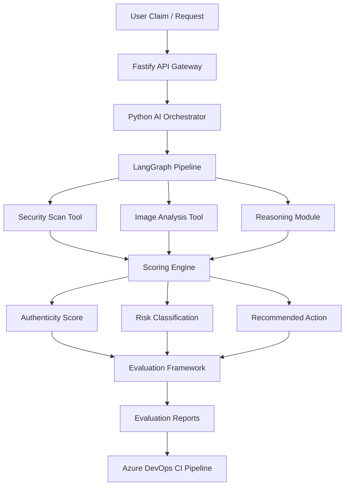

# AI Media Authenticity Analyzer

An AI engineering portfolio project that analyzes images for potential manipulation or AI generation using a modular analysis pipeline, structured reasoning, evaluation tooling, and CI-ready infrastructure.

The goal of this project is **not to build a perfect AI detector**, but to demonstrate the ability to design and implement a **production-style AI system architecture** including orchestration, evaluation, and explainability.

---

# Project Overview

This system analyzes media (currently images) and produces:

• authenticity score  
• risk level classification  
• detected heuristic flags  
• reasoning explanation  
• confidence explanation  
• recommended action  

The pipeline is built to resemble **real-world AI infrastructure**, where multiple tools contribute signals that are interpreted by a reasoning layer.

---

# Architecture

The system uses a modular pipeline orchestrated by **LangGraph**.



---

# Pipeline Flow

The image analysis workflow:

```
Intake
 → Security Scan
 → Image Analysis
 → Prompt Builder
 → Reasoning Node
 → Scoring
 → Output
```

Each stage contributes structured signals that feed the reasoning system.

---

# Core Features

## Image Authenticity Heuristics

The analyzer extracts structural indicators such as:

• aspect ratio anomalies  
• edge density  
• alpha channel presence  
• EXIF metadata  
• file signature validation  
• image size characteristics  

These signals are converted into an authenticity score.

---

## Structured Reasoning Layer

Instead of returning raw technical flags, the system generates:

• summary  
• reasoning explanation  
• confidence explanation  

This simulates explainable reasoning systems often used in production AI tools.

---

## Prompt Engineering + Versioning

The project supports structured prompt experimentation:

• prompt templates  
• prompt builder utilities  
• prompt preview in outputs  
• multiple prompt versions (v1 / v2)

This allows reasoning behavior to be evaluated across prompt designs.

---

## Tool‑Based Architecture

The system is intentionally modular.

Tools currently include:

• security scan tool  
• metadata extraction  
• edge density analysis  
• image structure flag detection  

This separation allows new tools to be integrated without rewriting the orchestration logic.

---

## Evaluation Framework

The project includes a built‑in evaluation system for comparing reasoning strategies.

Metrics include:

• latency  
• fallback usage  
• expected flag thresholds  
• reasoning length  
• confidence length  
• risk classification accuracy  

Evaluation artifacts:

```
evaluation/results.json
evaluation/report.md
```

---

## Azure DevOps CI Integration

The repository includes an Azure DevOps pipeline configuration that:

• installs dependencies  
• runs evaluation tests  
• generates reports  
• publishes artifacts  

This demonstrates how AI workflows can integrate into CI/CD pipelines.

---

# Example Output

Example analysis result:

```json
{
  "authenticity_score": 0.55,
  "risk_level": "medium",
  "flags": [
    "very_low_resolution",
    "unusual_aspect_ratio",
    "has_alpha_channel",
    "very_low_edge_density"
  ],
  "summary": "The uploaded image contains indicators that warrant manual review.",
  "reasoning": "...",
  "confidence_explanation": "...",
  "recommended_action": "manual_check"
}
```

---

# Repository Structure

```
AI_Media_Authenticity_Analyzer
│
├── api-gateway
│   └── Fastify API server
│
├── ai-orchestrator
│   ├── analyzers
│   ├── tools
│   ├── utils
│   ├── evaluation
│   │   ├── cases
│   │   ├── evaluator.py
│   │   ├── report_generator.py
│   │   └── reports
│   │
│   ├── graph.py
│   ├── main.py
│   ├── state.py
│   └── schemas.py
│
├── azure-pipelines.yml
└── README.md
```

---

# Technology Stack

Backend  
Python  
LangGraph  
Pydantic  

Image Processing  
Pillow  
NumPy  

API Layer  
Node.js  
Fastify  

Infrastructure  
Azure DevOps Pipelines  
GitHub  

---

# Running the Project

Clone the repository:

```
git clone https://github.com/<your-username>/AI_Media_Authenticity_Analyzer.git
cd AI_Media_Authenticity_Analyzer/ai-orchestrator
```

Create environment:

```
python -m venv .venv
source .venv/bin/activate
```

Install dependencies:

```
pip install -r requirements-devops.txt
```

Run analyzer:

```
python main.py
```

---

# Quick Demo

```
python main.py <<'EOF'
{
  "request_id":"demo-001",
  "file_path":"/path/to/image.png",
  "filename":"image.png",
  "media_type":"image",
  "mimetype":"image/png",
  "claim":"Is this image AI-generated?",
  "reasoning_mode":"rule",
  "prompt_version":"v2"
}
EOF
```

---

# Why This Project Is Valuable

This repository demonstrates the ability to build:

• orchestrated AI pipelines  
• tool‑based AI systems  
• structured reasoning workflows  
• prompt experimentation infrastructure  
• evaluation frameworks  
• CI/CD‑integrated AI projects  

The focus is on **AI engineering and system design**, not only model usage.

---

# Future Extensions

Possible future improvements:

• multimodal reasoning models  
• GAN artifact detection  
• larger benchmark datasets  
• simple web UI demo  
• cloud deployment  

---

# Author

Martin Enke  

AI engineering student focused on:

• AI systems design  
• Python backend engineering  
• applied AI infrastructure  
• creative technology and audio tools  

---

# License

MIT License
